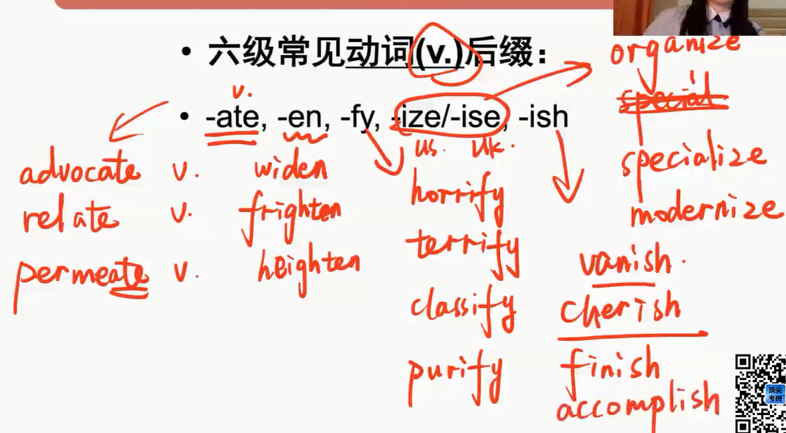

# 1.词汇

## （一）时间、空间

### 1. pre-  时间提前，预先

prewar 战前的

predict  v预言，预测，预先     dict：说

prediction  n语言

predictable   adj 可预测的

unpredictable   adj  无法预测的

foresee、forecast、预言

precondition=premise  n前提条件，先决条件

promise v/n 承诺

promising   adj 有希望的，有前途的

condition   n条件  v调节

conditional   adj 有条件的

air-conditioner   n空调

hair-conditioner   n护发素

hair-dryer  n吹风机

preview   v/n  预览，预演

### -dict-   -dic-   =say     言，词，说

dictionary   n字典，辞典

predict、predictable

addict  （元音字母+词根首字母：强调/去往） v使沉溺于

sb be addicted to sth  沉溺于坏事

addition  n 不良嗜好

contradict   v反驳，与..相矛盾  contra-   反   

contradiction=paradox  n矛盾，对立

paradoxical=contradictory adj 矛盾的

indicate   v 暗示

hint，imply，cue，suggest  暗示

### -vi-   -vis-  -vid-  -view-  =see   看

visible   a可见的

invisible  a 不可见的

advice   n建议（不可数）

suggestion  n建议（可数）

advise   v建议

provide    v提供，供应；规定  pro-方向向前

provision   n提供，供应；条款

provided/providing   conj  倘若，假如~~~if

revise   v修订，修改

revision    n修订，修改

supervise   v监督，监管~~oversee

overlook  v忽视，忽略

supervision   n监督

supervisor   n监管者；导师

visual  a视觉的

-audi-  听

auditory   a听觉的

audience  n听众

audit  v/n 旁听，审计

auditor   n 旁听者；审计员

viewpoint   n 观点=point of view

interview  v/n 访谈，面试

review   v/n 复习，回顾；评论，审核

evident   a明显的，显而易见的

evidence   n明显，证据，迹象

### 2. pro-  时间提前，预先；**方向向前**

proceed   v进行，前进；n收入，获利proceeds

process  n进程，过程  v加工，处理

microprocessor    n微处理器

proclaim  v宣告，公布，表明  -claim-  叫喊

proclamation  n宣告

declare，announce，affirm，assert 宣告，宣布，声称

project  v投影，投射，放映  n项目，工程，计划，规划   -ject-   投，射，扔 

projector   n投影仪

prospect  n前景，展望，未来  -spect-  看

prospective  a未来的，盼望中的

retrospect  v/n 回顾，追溯

### -spec-   -spect-    -spi-    -spic-   =look  看

prospect   n前景，未来，展望

prospective   a盼望中的，未来的

retrospect    v/n 回顾，追溯

inspect  v调查  

inspection   n调查

aspect  （**单独的a相当于e-，ex-**）n外貌，样子，方面

from all aspect   从各方面而言

expect   v期盼，期待 

expectation    n期盼，期待

unexpected   a预料之外的，意想不到的

respect   v/n尊重  n方面=aspect

respectable    a可敬的

respective    a分别的，各自的

perspective   （**per-   渗透，一直**）a透视的，n透视图，观点，看法

suspect   （**su-**  **下面的**）  v怀疑

suspicion   n怀疑

suspicious   a怀疑的

conspicuous   a明显的=evident

### 3.  fore-  在...之前

forearm  n前臂，v预先准备

sb be armed with sth 

forehead  n前额

forewarn  v告诫，通知，预告

forecast   v/n语言预测

prediction  n预言

foresee  v预见，预知

foreseeable   a可预见的

### 4.   an-  anci-   ant-   ante-   在...之前

ancestor   n祖先，祖宗 （**-cest-   走**）

 ancient   （**-ent  形容词后缀**）a古老的，古代的，过时的

ancient myth  古老神话

antique  a古老的，古董的   n古玩，古董（**-ique=-ic 形容词后缀**）

antique shops   古玩商店

antecedent  a在前的，先行的 n祖先，先行词 （**-ced- 走**）

**-ent   -ant  都是形容词后缀，也可做名词后缀，表示人或物**

### -ced-  -ceed-   -cess-   -cest-   =go  走

precede   v领先，优先

exceed     v超出，超过，胜过

excess    n超过，胜过，过多，过量，过分

excessive    a超过的，胜过的，过多的

proceed   v前进，前行 

proceed to do sth  继续做

process   n进程，过程  v加工，处理

procedure   n流程，步骤  （**-ure名词后缀**）

succeed   v继承，连续，成功

succeed in doing sth 成功做某事

success   n成功

succession   n继任，连续

successful   a成功的

successive   a连续的

successor   n继承人

recede   v后退，倒退

recession   n后退，倒退，经济衰退

depression，financial crisis经济危机

booming，thriving，flourishing，prosperous 繁荣的

predecessor   n前任，前辈

antecedent    n祖先，先行词 a先行的

ancestor   n祖先

**ne-=non-=neg-  否定**

necess**itate**   v使...成为必须

necess**ary**    a必须的，必要的

necess**ity**   n必要性，必需品

**ac**cess   v接近，靠近（ac-  去）n接口，入口

access**ible**  a可接近的

### 5.   post-   之后，后面

postgraduate  a研究生的，n研究生

postwar   a战后的

postmodern  n/a 后现代

postpone   v使延期，延缓（**-pon-  放在原定时间之后**）delay

### -pos-  -posit-  -pon-  =put  放置

post   v发送，发布    n职位；邮件

position   n位置，职位，地位

purpose    n目的，意图

depos**it**   v存储，储蓄

withdraw  v取钱，撤退

positive   a积极的

negative  a消极的passive

compose    v组成，构成

composition    n组成，构成，作文，作曲，构图

component   n成分，元素 element

**op-  逆反**

oppose   v反对

opposite   a相反的，对立的

opponent   n对手，敌人

postpone   v推迟

expose   v暴露

exposure  n暴露，揭露，揭示

propose   v求婚，提议，建议

proposal   n求婚，提议，建议

## （二）否定

### 1.  ab-  abs-   相反的，反常的，否定

abnormal=anormal  a反常的，异常的，不规则的

norm  n准则，规范

China central Normal University  华中师范

abuse  n/v滥用，辱骂

child abuse 虐待儿童

authority abuse  滥用职权

absent   a缺席的，不在场的，缺乏的，不在意的

absence  n缺席，缺乏

absence of mind  心不在焉

lack、dearth  n缺乏，缺席

shortage   n短缺

### 2.   anti-   对抗，相反

antiwar  a反战的

anti-virus   a（软件)杀毒的，防病毒的

epidemic   n流行病

pandemic   n大流行现象

infect  v感染，传染

infection   n传染病

infectious   a传染的，感染的

disinfect   v消毒

anti-dumping  a反倾销的

dump   v抛弃，倾倒，倾销

antibody   n抗体

###　３.　dis-　　不，没有

dishonest　　ａ不诚实的，不老实的，狡猾的，不正直的

integrate　　　ｖ整合

integral　　　ａ完整的

integrity　　　ｎ完整性，正直，诚信

foxy、sly、cunning、tricky、crafty    a狡猾的

disobey   v不服从，不顺从

obidient   a服从的

obidience    n服从

comply with=obide by=submit to=yield to（介）=surrender to（介词）  遵守

A be subject to B   A服从于B

disorder  n混乱，动乱，骚乱 v使混乱，扰乱

chaos、mess    n嘈杂，凌乱

mess   n食堂

discredit   v使不可置信 n丧失名誉

### -ord-   -ordin-  =  order  顺序

order    n顺序，秩序，命定，订单   v命令，下订单

orderly     adj有序的

disorder     v/n使混乱

ordinary    a普通的，常规的

extraordinary    a非凡的，格外的

**co**ordinate     v协调

coordination   n协调

###  -cred-  =believe   相信，信任

credit    n信用；学分

discredit     v/n丧失信誉

cred**ible**    a可信的

**in**credible   a难以置信的

### 4.   il-  im-  in-  ir-   不，无，一般放在形容词前

illegal    a不合法的，违法的   n非法，移民，非法劳工

legislation   n立法，法律

legitimate   a合法的，合理的

illogical    a不合逻辑的，无意义的

immature   a不成熟的，未完成的，粗糙的

maturity  n成熟

immobile   a固定的，不变的，稳定的

stable，fixed，steady，constant，stationary，inherent，immortal，eternal，permanent，invariable，motionless，forever

constant   n恒定的，不变的   n常数，常量

impartial  a不偏不倚的，公平的，无私的  just/fair

selfless   无私的

injustice  n不公平，不正义=unfairness

informal  a非正式的

irrelevant   a不相关的，无关的

A be relevant to B  A与B相关

related     a相关的

relative     a相关的，n亲戚

irregular   a无规律的，不规则的

irrational   a 不合理的，荒谬的，不理性的

reasonable   a合理的

ridiculous=absurd   a荒谬的

### -mob-    -mot-    -mov-  =  move   动

mobile   a移动的   n流浪者，无家可归者

**auto**mobile   n汽车=auto

vehicle   n汽车

remote   a遥远的，可能性小的

motion    n移动，运动

motionless   a静止的

motive      n动机，目的

motivate     v刺激，激励

stimulate、encourage、incentive（n）、inspire、accelerate（加速）、spur（n马刺）、promote、prompt（a快速的，v促进）、improve、urge（v催促 n愿望）、facilitate、boost（v提升，促进）

promote   v促进；晋升；促销

promotion  n促进，晋升，促销

emotion   n情绪，情感=affection=sentiment

affectionate   a深情的

sentimental   a多愁善感的

movement  n移动

movie  n电影

film   n电影；胶卷，胶片

remove   v移除

removal   n移除

### 5. non-  不，非

nonsense   n胡说，废话  a无意义的，荒谬的

sense   n道理，理智，感觉

a sense of safety 安全的

a sense of inferiority  自卑感

common sense  常识

sensitive  a敏感的

sensible  a明智合理的

nonexistent   a不存在的

nonexistence   n不存在

nonprofit   a非营利的

profitable  a有利可图的

nonstop   a直达的，不停的，n直达车  adv不休息地

### 6. ob-  op-   逆，倒，否定，反对

ob**ject**  v不赞成，反对  n宾语，客体，对象，物体，目标

ob**st**acle    n障碍，障碍物  （-st-  站立，-acle 抽象名词后缀）

barrier  n障碍物

oppose  v反对，抗争，抵制

opponent   n对手，反对者  a对立的，敌对的

opposite   a相反的

### **-ject-  -jac-   =   throw    扔，投掷**

project   n项目，工程，计划   v投影，计划，投射

inject    v注射，注入

injection    n注射，注入

reject    v拒绝，排斥，反对

rejection   n反对

eject    v喷射，喷发

ejection  n喷射

**sub**ject   n主语，主体，主题，学科   v使...服从于   a服从的

subject A to B  使A服从于B

A be subject to B   A服从于B，A受B的影响，A遭受B

subjective    a 主观的

subjectiveness   n主观性

object    n宾语，客体，目标，对象，目的

objection   n反对

objective   a客观的   n目标

objectiveness   n客观性

### **-st-   -sta-  =  stand   站立**

state    n国家，州，状况，情形  v说明，陈述

current state/status   现状

statement    n陈述，说明

status    n情形，状况，地位，身份 

station    n车站

stationary   a静止的

stable   a稳定的

stabilize   v使稳定

steady    a稳定的，不变的

steadiness   n稳定

establish   v建立，竖立

distance    n距离

distant    a遥远的

constant   a 持续不断的，恒定不变的  n常数

**circum**stance    n环境=setting   （circum-  周围）

obstacle    n阻碍

### 7.  un-  不，无，没有

unavailable   a难以获得的，无价值的，不能利用的  （**-vail-  =-val-  价值，-able可...的**）

avail  v对某人有用，有助于  n效用，利益，价值

available   a有效的，有价值的，可利用的

availability    n有效性，可利用性

accessible   a可接近的，可利用的

accessibility   n有效性

valid  a有效的，有价值的

invalid  a无价值的，无效的

invalidate   v使无效，使无价值

unavoidable  a无法避免的，不得已的=inevitable

unbearable  a难以忍受的，经不住的

bear，stand，suffer，withstand，undergo，endure，put up with，tolerate

unconscious   a失去知觉的，无意识的，不自觉的

sb  be  conscious of sth  某人意识到

unconditional  a无条件的，无限制的=unlimited=infinite

precondition  前提条件=premise

### 8.    de-   否定

decompose  v分解，使腐烂

component  n成分，元素

defame   v诽谤，中伤

defamation   n诽谤

outstanding，notable，noted，significant，excellent，exception，eminent（有名的），prominent，remarkable，distinguished（杰出的），prestigious，well-know   杰出的，出名的

prestige   n名望

demerit   n缺点，过失，短处=disadvantage=shortcoming

## （二）否定

### 1.  be-   en-   em-   使动

becalm   v使安静，使停滞

befool   v愚弄，欺骗

deceive   v欺骗

deception   n欺骗，谎言

（-ceive-   拿）

enlarge   v扩大，放大

expand，extend，exaggerate，**amp**lify，magnify，stretch（v延伸）

magnificent  a壮观的，宏伟的，宏大的

**-amp-   -amb-    大**

ample   a充足的

ambition  n志向，雄心壮志

ambitious   a有雄心壮志的

encourage    v鼓励，鼓舞，促进

empower   v授权，准许=enpower

authorize    v授权

authority    n权威，当局

### 3.  com-  con-   cor-  强调，共同一起，全部

commemor**ate**   v纪念，庆祝

celebrate   n庆祝

celebrity   n名人，明星

compel   v强迫，迫使（-pel-   推）

compulsion   n强迫

compulsory   a强制性的，义务的

conduct   v引导，指导，管理，执行  n管理，执行，行为

the acting code =the code of conduct   行为准则

conduct an experiment  做实验

cor**rupt**   v使腐败  a堕落的，贪污的（-rupt- 破裂）

corruption   n贪污腐败

**-duc-  -duct-  引导**

introduce   v引入，引荐，介绍

introduction   n介绍，引入

conduct   v指导，管理，指挥，执行  n行为

conductor  n售票员，导体，指导员，指挥家

semiconductor   n半导体

reduce   v减少

reduction   n减少

**-rupt-  =break  破**

interrupt   v打扰

disrupt    v打扰，扰乱，破坏

bankrupt  v破产  a破产的

bankruptcy   n破产

corrupt  v腐败   a贪污的

bribe   v行贿

bribery   n行贿

erupt    v喷射，喷发

eject    v喷射，喷发

## （四）方向，动作6

## 1.   de-  减少，向下，否定，强调

devalue   v使贬值，降低价值，贬低

-valu-    -vail-     价值

evaluate  v评价

available    a有价值的，可利用的

depreciate     v贬值，跌价，轻视

-preci-    价值，价格

appreciate   v升值，感激，欣赏

depress   v使沮丧，使萧条

depression，recession，gloom    萧条

booming，prosperous，flourishing，thriving   繁荣的

## 2.   contro-    contra-   counter-   相反的

controversy    n争论，争议，论战

contro**vers**ial   a有争议的=disputable  （**-vers-   转**）

dispute    n争论

contrary    a相反的

on the contrary   相反地=conversely

contra**dict**   v反驳，驳斥，与...矛盾

contradiction    n矛盾=paradox

contradictory   a矛盾的=paradoxical

counteract    v消除，抵消，中和=balance/offset

counter-attack   n反击，反攻

counter-strike    反恐精英

cross fire   穿越火线

### -act-  =to do or drive    做，驱使

act    v行动，表演，表现   n行动，行为，法案

the acting code/the code of conduct   行为准则

action    n行动

react   v回应，反应

active    a活跃的

activity   n活动

activate    v激励

activist    n积极分子

interact    v互动，沟通，相互作用，相互影响

interaction   n互动

transact    v交易

transaction   n交易

### 3.    dif-   dis-   分开，分散，否定dis

differ   v区分，区别；使...不同

differ A from B   把A和B区分开来

A has some differences from B

A be different from B

indifferent    a漠不关心的

diffuse    v传播，扩散，弥漫   a弥漫的，散开的

diffusion    n传播，扩散，漫射

permeate   v弥漫，扩散，渗透

per**vad**e    v渗透，扩散  （**-vad-   走**）

**-fus-    流动**

refuse   v拒绝

refusal    n拒绝

confuse   v混淆，困惑

confusion   n困惑

dis**miss**   v解散，解雇，把...免职，拒绝（**-miss- 送**）

### 4.e-  ex-   出，外

e**vad**e    v逃离，逃避，逃脱，躲避（**-vad- 走**）

invade    v入侵

evasion   n

evasive    adj

pervasive    a普遍的，流行的

evaluate   v评价，评估

assess、appraise、estimate、rate、reckon     v评估，评价

ex**ceed**    v超出，超过，超越

excessive    a过多的，过量的

excess   n超过

### 5.   en-  em-   进入...之中

en**cage**   v关在笼中，把...关起来，禁闭

imprison   v关押

sentence sb a life imprisonment    判某日无期徒刑

enroll   v注册，登记，加入，招收

enclose   v把...围起来，附入，把...装入信封

enclosure   n围绕，圈用地

### 6.   in-   im-   进入...之中，在里面

immigrant   v移入，移居国内

immigrant   n移民

emigrate    v移出

emigrant     n移民

migrate    v移动，迁徙，不强调方向

migrant   n流动的人口，候鸟

migrant workers    农民工

import    （**-port- 拿**）  n进口，进口商品，输入，重要性，意义  v输入，进口，对...有重大关系，意味着

importance    n重要性，意义

important    a重要的

port   n港口

export   v/n出口

output   n产量，产出

portable   a可携带的

inherent   a固有的，内在的，天生的（**-her- 黏附**）

adhere to   黏在...；坚持=cling to=stick to/with

in**nat**e   a天生的，特有的，固有的，直觉的

**-nat-   出生**

innate    a天生的

native    a本土的，本国的 native speaker 本土人

nation    n国家，民族

national   a国家的，民族的

nationality    n国籍

international    a国际的

### 7.  inter-  在...之间，相互

interview   v/n  面试，访谈

interact   v相互作用，互动

interpersonal   a人与人之间的，人际的

### 8. re-  retro-    回，向后，相反

reflect   v反射，折射；反应；反思，思考，深思熟虑

（**-flect-  弯曲**）  

unreflecting    a不假思索的

reverse   v反转，倒转，逆转，反对  n倒转，反向  a反面的，颠倒的，相反的

converse  a相反的，谈话

**-serv-  =  save   保存** 

reserve    v保存

converse    v保存，保守

preserve    v保存

conservative   a保守的  n保守党派

conversation&conservative

retrospect   v/n 回顾，回想，追溯

suspect   v怀疑，n嫌疑人

inspect  v调查

regress   v倒退，逆行，退化  n回归，退回，腿部，退化

**-gress-   -grad-    = step  步，走，级**

progress    n进步，进程，过程=process  加工，处理，v进步

progressive   a先进的=advanced

congress   n国会，代表大会

conference   n会议

con**vent**ion   n会议，例会，惯例，传统

conventional   a传统的

forum   n论坛

aggressive    a侵略性，激进的，好斗的，有野心的（贬义的）

ambitious   a有野心的（褒义）

**-amb-    大，  -it-   走**

initiate   v开始，开创

initial   a开始的，最初的

initiative   a开始的  n创新精神

initiator   n创始人

**-amp-   大**

ample   a充足的

amplify     v放大，扩大

aggress    v侵略，入侵

grade    n等级，年级

upgrade    v/n  升级

degrade    v/n   降级

downgrade   v/n   降级

gradual  a逐步的

graduate   v毕业  n毕业生

### 9.  sub-   向下，低于，第二

subconscious   a下意识的，潜意识的

subconsciousness     n潜意识

submarine    a水下的，海底的  n潜艇，海底生物

submit   v呈交，递交，服从，屈从（**-mit-  送**）~to

submission    n

submissive   a服从的

subject    v/a  服从于    

A be subject to B   A 服从于B

suburb   n郊区，城郊，边缘，附近（**-urb-   城市**）

urban   a城市的

rural   a 农村的

outskirts   n郊区

### 10.   sur-   上面，超过

surface    n表面，外观，外表，地面，水面  v浮出水面，显露  a表面的，肤浅的

superficial   a表面的，肤浅的

surpass    v超过，优于，胜过

unsurpassed  a无与伦比的

surplus  a过剩的，过多的

survive   v幸存，生存，存活

survival   n幸存

### 11.   trans-  越过，穿过，转移

transform   v转变，改变，变形

transformer   n变形金刚，变革者

transformation    n改变，转变

transfer   v/n  转移，转让，转学，换乘（**-fer- 拿**）

confer  v协商，商量，授予

conference    n会议

refer to   v提及，涉及，参考，查阅

transfuse   v输血 （**-fus-  流**）

transfusion   n输血

diffuse   v扩散，发散  a弥漫的

transplant   v移植，移种

transplantation   n移植

### 12.  under-  下面

underline   v强调  n下划线

emphasize   v强调

underground   a地下的，秘密的   n地铁，地道，地下组织

tube，subway，metro   地铁

metropolitan   a大都市的

## （五）倍数关系

### 1.sym-  相同

sympathy   n同情，慰问，赞同（**-pathy-** 感情）

A be in sympathy with B

A 赞同B

sympathetic   a同情的

symphony   n交响乐（**-phon-   声音**）

### 2.  hemi-  semi-  半

hemisphere   n半球

semicircle   n半圆形

semi-colony   n半殖民地

colonial  a殖民地的

semiconductor   n半导体

### 3.   re-   再一次，反复

recycle    v回收利用，使再循环

circulate     v循环

circuit    n电路，回路

circulation    n发行量

reclaim     v/n 悔改，回收

claim   v/n  声称

respect  v尊敬 n尊敬，方面

prospect    n前景，未来，展望

in limited respects/aspects    有限的方面

from all respects/aspects   各方面

produce   生产

reproduce   v再生产，再现，繁殖，繁衍=procreate

reproduction，procreation

productivity    n生产率

### 4. co-   com-   con-   共同，全部，一起

coexist    v同时共存，和平共处

coexistence   n共存

cooperate   v合作，配合，协助

operating income    运营收入，营业收入

collaborate   v合作

cooperation    n合作

corporation    n公司，企业

compassion    n同情，怜悯，恻隐之心

sympathy   n 同情  sympathize   v

compassionate    v同情

passionate   a热情的

zeal   n热情

zealous   a热情的

enthusiasm    n热情

enthusiastic    a热情的

conspire     v共同谋划，协力

conspiracy   n阴谋

**-spir-**    呼吸

aspire   v有志于做

aspiration=ambition    n志向

inspire   v吸入，鼓励

expire   v短期，到期，终止

expiration    n

### 5.  multi-   多

multicultural    a多种文化的

multinational corporations   跨国公司

multi-media   n多媒体   a多媒体的

medium   n媒介，媒体（单数）  a 中间的

media    n媒体（复数）

bacterium    n细菌（单数）

bacteria     n细菌（复数）

multilingual    a多种语言的

**-lingu-   语言**

linguistics   n语言学

linguist   n语言学家

**bi**lingual    a双语的

bike，bicycle

##  （六）程度

### 1. over-  过度，过分

overconfident    a过于自信的，自负的=conceited

pretend  v假装

pretentious   a做作的，自负的

overestimate   v对...估计过高  n过高的评价

rete，reckon，asses，appraise    v估计

overrate，overvalue，overstate    v高估

overlook=ignore=neglect=omit   忽视

oversee=monitor=supervise    v监督，监管，监视

oversize   a太大的   n特大号

### 2.   out-    在外面，超过

outdoor   a在户外的，野外的

outline   n轮廓，大纲，概要  v概述，描绘...的轮廓

generalize    v概述

abstract    a抽象的   n摘要

concrete   a具体的   n混凝土

outrage   n愤怒，暴怒 ，v激起愤怒，对...施暴行

outstanding   a杰出的，显著的

distinguished，famous，excellent，well-known，noted，brilliant，eminent，prominent，remarkable，significant，prestigious     著名的，有声望的

prestige=fame    n名望，声望

## （七）状态及性质

### 1. magn-   大

magnify    v放大，夸奖

**-amp-   -amb-    大**

ample   a大量的，充足的

amplify   v扩大，放大

ambition   n雄心=aspiration

sufficient，abundant，adequate，enough  充足的

magnate    n大亨，富豪，权贵

### 2. max-   maj-   大，主要

maximum   n最大值，极大，极点  a最大值的

majority   n大多数，成年   n专业，主修

a ~ of  大部分的

minor   a少部分的   n选修

minority    n少数（民族）

### 3. micro-  小， macro-   大

microphone    n扩音器，麦克风

macroeconomic    宏观经济学

microeconomic     微观经济学n

microelement   n微量元素。微型原件

component，ingredient，constituent     成分，组成元素

microscoppe    n显微镜

telescope     n望远镜

microwave oven   微波炉

### 4.mis-   错误，坏

 misunderstand   v误会，误解，曲解

misinterpret    v误解

misbehavior    n不礼貌，品行不端，违反规则

miscalculate    v误算

misfortune   n不幸，灾难

misery，adversity   n苦难，不幸

misguide   v误导

mislead    v误导

### 5.auto-  自动，自己

automate   v使自动化

automated，automatic   a自动化的

autocriticism    n自我反省，自我检讨

automobile    n汽车=auto=vehicle   交通工具，汽车

### 6. ex-   前者

ex-wife    前妻

ex-minister    n前任部长

# 阅读70min

## 选词填空

第一步：精度文章首句，牢记话题

第二步：选项词性归类

第三步：根据语句特点，缺哪类词选哪类词，遇见不确定的空，最后再选

第四局：纵观全文，检查确认

### 词性看后缀

#### 名词

**-er,-or,-ar,-ee,-ess,-ian,ist,-ant,-ent  人/物**

**-ism 主义**

**-ity,-ty,-ion,-ment,-ship,-th,age,-ing **

**-ance,-ence,-ancy,-ency,-hood,-ness**

#### 形容词

**-able,-ible   可以...的，能够...的**

**-less  否定**

**-ed  动作完成或被动**

**-ate,-ful,-ious,-ous,-ant,-ent,-ic,-y**

**-ary,-ery,-ory,-al,-ial,-ual,-ing,-ive**

#### 动词

**-ate,-en,-fy,-ize,-ise,-ish**

#### 副词

**-ly,-wise,-wide,-ward(s)**

#### 考点

 

cling to(介词)/with    粘着，坚持

stick to/with  坚持，粘着

adhere to

insist on 

persist in

 

 

 

# 2.听力

## 1.发音连音规则：结尾辅音+元音发音开头

get it over 完成...

get over it  克服...

连音条件：只存在于意群之中

put it on  穿上

put in on the desk  

black and blue 青一块紫一块

## 2.爆破音规则：爆破音+非元音（元音，连读）

p b t d k g

单词结尾为爆破音，在语句中轻读或略读

do some odd jobs 打一些零时工

## 3.轻音浊化

六级偏英式英语

unorthodox     非正统的，非正规的

upbringing     养育，抚养

eminent scholars   杰出的学者

satire   讽刺

unprecedented   史无前例的

dye   染料

huge hit    大受欢迎

### 看听力选项

### 长对话题型   8%

**长对话重要场景：工作场景**

opening    空缺职位

transfer   调任

**工作场景场景词介绍：**

Want ad  招聘广告

job vacancy=job opening  职位空缺

recruit  招聘

position=post  职位

apply for a job 申请

application，submit your application

application letter/cover letter 申请信

resume  简历

applicant=candidate   申请人，候选人

job interview/interviewer/interviewee

short list  最终候选名单

qualified or slim  合格还是机会渺茫

hire/offer

benefits package/welfare 福利待遇

salary，pay-raise/rise 加薪

promotion 升值

traveland socialsecurity，insurance 旅行和社会保险

paid vacation  带薪休假

transfer调任

job-hopping 跳槽

quit/resign  辞职信

going out of business  倒闭

unemployment 失业

self-employed  个体经营

fire=lay off=dismiss 开除，裁员

retire/phased retirement scheme  阶段性辞退

**长对话重要场景：校园生活**

conducive to   有助于

on campus/off campus   校内，校外

admissions office    招生办

enroll/sign up/register    入学，注册

tuition and fees   学杂费

check book   支票本

scholarship   奖学金

assignment    作业

paper  论文

term paper 学期论文

essay  文章，散文

book list/book report   读书清单，读书报告

presentation/group presentation   小组演讲

dissertation/thesis   毕业论文

course   课程，一门课

lecture    演讲式的大课

curriculum   课程体系

introductory course   入门课

advanced engineering course   高级工程学课程

extra-curriculum activities     课外活动

optional/elective course     选修课

compulsory/required course   必修课

seminar     研讨会

take/drop the course    选课，退课

skip the class   翘课

play truant   逃学

drop out 退学，辍学

freshman/sophomore/junior/senior

undergraduate/postgraduate/graduate school 研究生院

tutor/supervisor/advisor  导师

dean   院长，系主任

dormitory/lounge    宿舍，休息室

canteen   食堂

cafeteria   咖啡厅

bachelo/master/doctor degree  学士学位，硕士学位，博士学位

**长对话重要场景：演播室/新闻直播间**

Mediterranean sun   地中海

 this is ab from the news   

at the scene/on spot  在现场

welcome to our program，our  guest，

good evening and welcome to   

host 主持人

hostess 女主持人

international/domestic stories  国际国内新闻

general social concerns   普遍关注

**长对话次要话题 ：饮食    **

**饮食场景词**

I'm sorry at the tables have been booked out.订完了

dish

starter/main course/desserts   按顺序上的菜

cuisine   菜系，烹饪法

steak

Spanish delicacy  西班牙美食

cured ham  熏火腿

salad   沙拉

cook   厨具

sauce  酱汁

oven  烤箱

microwave  微波炉

take-away，take-out  外卖

check the bill please  

it's my treat.

Shall we split the bill?  AA

tip  小费

**交通出行**

rush hours/traffic hours    高峰期

break atraffic rule/violate the traffic regulation  违规

driving license  驾照

over speed=speeding  超速

speed limit   限速

speed bumps   限速带

jump/run the traffic light  闯红灯

overtake  超车

ticket  罚单

fine   罚款，罚金

parking lot  停车场

private lot  私人停车场

direct/transfer flight  直航/转机

boarding pass  登机牌

shuttle bus    穿梭巴士

jet lag   时差感

## 5. 篇章听力解题技巧

**实验研究型文章**

 

